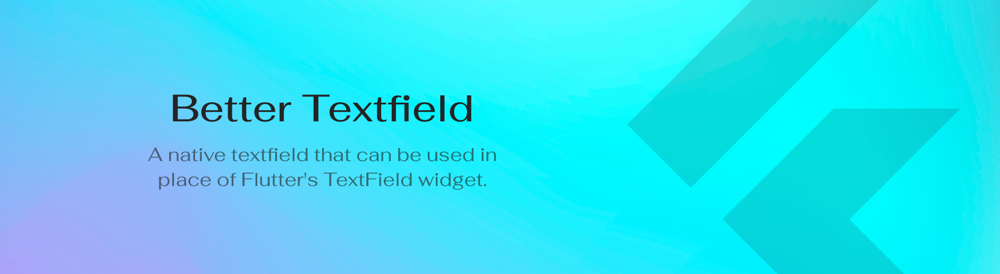
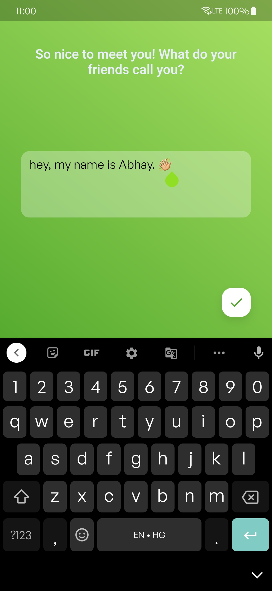
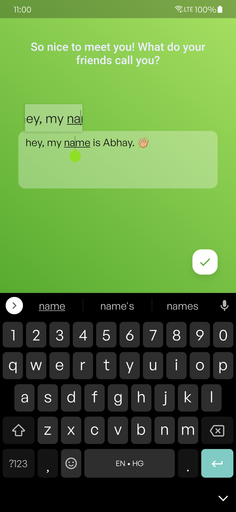
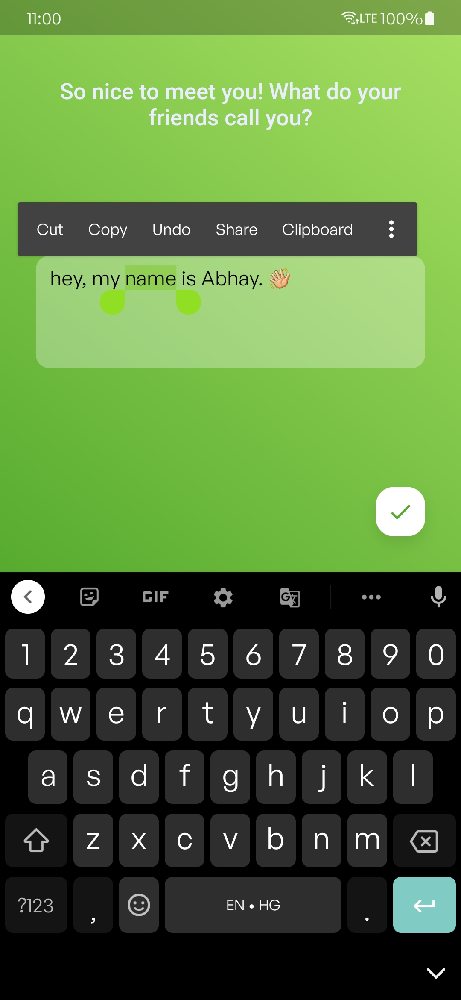

<h1 align="center">
Better Textfield
</h1>
<p align="center">
<a href="https://flutter.dev/"></a>
<a href="https://github.com/LiquidatorCoder/better_textfield"></a>
<a href="https://github.com/LiquidatorCoder/better_textfield"></a>
</p>
<p align="center">A native textfield that can be used in place of Flutter's TextField widget.</p>



## Demo

https://user-images.githubusercontent.com/42910433/147383853-7d2c0e40-8d5d-40ef-b7f7-4349ae15b796.mp4

Here are some screenshots of the demo app:

| Native Text Field 	| Magnifier (loupe) effect	| Native Text Toolbar 	|
|--------------	|--------------	|--------------	|
|   |  	|   	|

You can also access the demo app via this [link](https://github.com/LiquidatorCoder/better_textfield/releases) or by visiting `release` directory in the repository.

## Install
The plugin package is under development.
If you still want to use it in your app you can use the code from this repository.

## Features

- Better dragging of the cursor
- Magnifier (loupe) effect
- Fixes all issues described here: [link](https://pastebin.com/iqnjMa1m)
- Supports setting values for text
- Also supports retrieving input text via the text controller
- Decent performance
- Supports text selection and clipboard
- Supports autocorrect
- Supports direct sharing of text
- Supports only Android for now

## Problem
We generally use TextField and TextFormFields widgets for input field. If you notice, there is a glitch in Flutter’s widget while dragging the cursor, where within a word if you drag the cursor it works fine, but if you try to drag the cursor from one word to another, hen draggable cursor disappears.

(Screen recording attached for reference for Reflectly app developed in Flutter.)

https://user-images.githubusercontent.com/42910433/147383865-c154c661-8e6e-4ebf-a5c5-c06e4c6dbf44.mp4


## Solution/Approach
Since this problem only occurs in the TextField widget available in Flutter, we can use the Hybrid composition of AndroidView in Flutter to display a native textfield instead of a regular textfield.
Note, however, that rendering an AndroidView inside a Flutter widget is quite performance intensive and can slow down your app in some cases.
Also, we need to bump up the `minSdkVersion` to at least 19 to support hybrid composition.

I have referred to the following [docs](https://docs.flutter.dev/development/platform-integration/platform-views) to understand how to host a native view in Flutter.

Next, I created a MethodChannel to communicate with the native code.

I also created a native text field controller class to help me retrieve and set text values in the native text field using the MethodChannel.

And that's about it. If you do it right, this only takes 20-30 minutes and greatly improves the app experience if your app is primarily text input based (like a text editor app).

>Note: We can also extend this approach to support iOS UIViews.


## Code Explaination

The structure of the `lib` directory of the app is as follows:

```
│   main.dart [Main app file (starting point of the app)]
│   
├───controllers
│       native_text_field_controller.dart [NativeTextField controller, which handles the communication of data between the textfield and the flutter app] 
└───views
        home_page.dart [Home page of the demo app]

```

The structure of the `android\app\src\main\kotlin\com\abhay` directory of the app is as follows:

```
└───better_textfield
        MainActivity.kt [Main activity of the android app]
        NativeView.kt [Native text view class, which is the view that is displayed on the screen]
        NativeViewFactory.kt [Native view factory class, which is the factory class that is used to create the native view]

```
## Built With

* [Flutter](https://flutter.dev/)

* [Kotlin](https://kotlinlang.org/)

## Stay Up-to-Date


